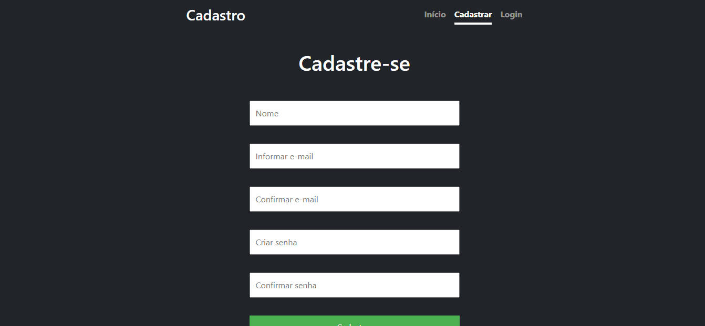
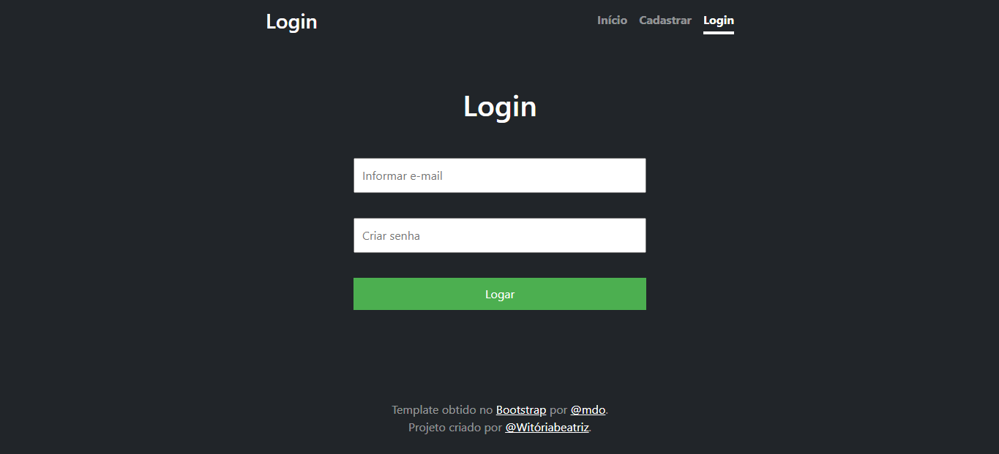

# ATD II - Aplicação de Cadastro e Login
Este é um pequeno projeto desenvolvido para ensinar conceitos básicos de acesso a banco de dados utilizando PHP como linguagem de back-end. Ele consiste em uma aplicação simples de cadastro e login.
# Descrição
Este projeto é uma aplicação web que oferece funcionalidades de cadastro e login. Foi desenvolvido como parte de um curso para ensinar aos estudantes os princípios básicos de interação com bancos de dados utilizando PHP.

# Visão Geral
O projeto fornece uma interface simples para que os usuários possam se cadastrar e fazer login. As informações dos usuários são enviadas para um servidor onde são processadas e armazenadas em um banco de dados.

# Tecnologias Utilizadas
HTML5: Estrutura das páginas.

CSS3: Estilização das páginas.

Bootstrap 5: Framework CSS para design responsivo. 

PHP: Processamento dos dados do formulário e interação com o banco de dados.

MySQL: Banco de dados para armazenamento das informações dos usuários.
Estrutura do Projeto

# Início

# Cadastro

# Login

# Autores

 Witória Beatriz Dos Santos